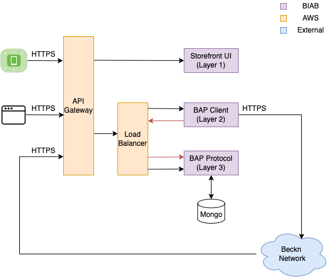

# Beckn in a Box BAP

## Overview

The BIAB BAP is comprised of 3 layers:

- UI Layer: The UI layer is the frontend implemented using Vue.js Storefront.
  The UI layer interacts with the client layer using the client protocol API
  definitions defined here.
- Client Layer: The client layer receives inputs from the UI layer and initiates
  Beckn protocol calls to the Beckn network. The client layer interacts with the
  protocol layer to get the responses from protocol callbacks. It is implemented
  using Kotlin.
- Protocol Layer: The protocol layer receives protocol callback responses from
  the Beckn network and saves them to the database. It is implemented using
  Kotlin.

The `protocol-dtos` is a repo that contains all the schema objects which are
used across the protocol, and the client levels. The JAR is versioned and
imported as dependency of the client and protocol repos.

You can see the logical architecture below:

One whole API call and callback would be as below :

- The UI layer calls the Client Layer to trigger the BAP protocol calls to the
  Beckn Network
- The Client layer makes the call to the Beckn network
- The callback response comes to the BAP protocol endpoint on the protocol layer
  and the response is saved to the database.
- The UI layer polls the client layer using messageId for responses. The client
  layer calls the protocol layer to get the response saved to the database.
